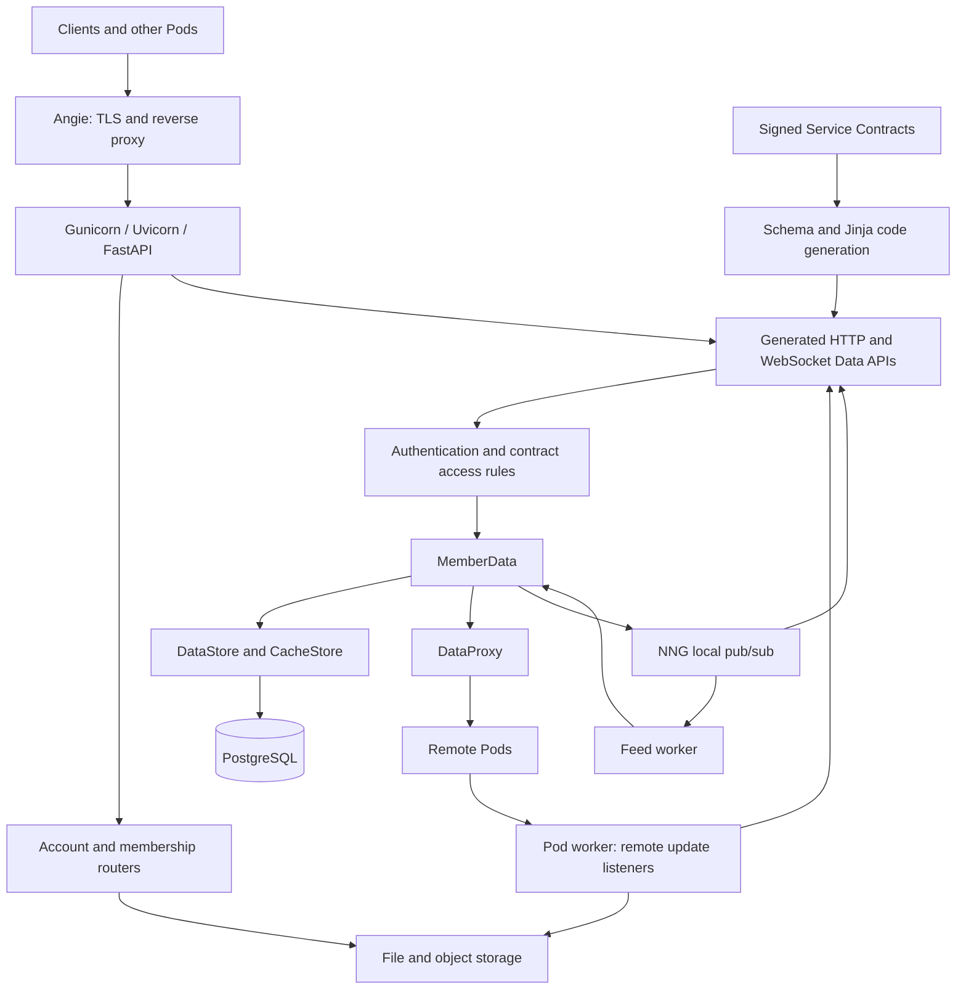
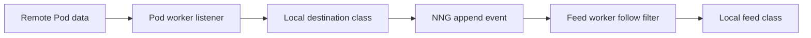

# Podserver architecture

The Pod is a user-owned personal data store. It hosts one **Account** and a separate **Member** identity for each joined service. Each signed **Service Contract** defines the data classes, access rules, and Data APIs for that membership. The Pod combines a FastAPI application, background workers, PostgreSQL, file/object storage, and an Angie reverse proxy.

This summary describes the current working-tree implementation, inspected on 2026-09-24. It follows the vocabulary in [CONTEXT.md](../CONTEXT.md); the repository split described there is a future design, not the current module boundary. This is a source-level description, not a deployment validation.

**Runtime and startup.** [Dockerfile-pod](../Dockerfile-pod) installs the application and invokes [podserver/files/startup.sh](../podserver/files/startup.sh). That script runs bootstrap to completion, starts `pod_worker.py` and `feed_worker.py` as background processes, and runs Gunicorn in the foreground. The root-level `startup.sh` is a separate script; it is not the startup file selected by the Pod image.

[bootstrap.py](../podserver/bootstrap.py) prepares the network trust material, Account secrets, registration, storage, memberships, and Angie virtual-host configuration. With `BOOTSTRAP=BOOTSTRAP`, it can create missing Account secrets. It joins services listed in `JOIN_SERVICE_IDS` and prepares Member certificates and registrations. PostgreSQL setup includes database creation/restore logic in [PostgresStorage](../byoda/storage/postgres.py).

[main.py](../podserver/main.py) constructs the FastAPI application and initializes each API process through its lifespan function. It creates a `PodServer`, loads the Account and its memberships, opens the stores, and enables each membership's generated Data APIs. [gunicorn.conf.py](../gunicorn.conf.py) selects Uvicorn workers and binds to `HTTP_PORT`, defaulting to 8000. The image startup script defaults to one API worker and explicitly records a limitation around propagating new memberships to multiple workers.

**Module responsibilities.** The `podserver/` directory contains entry points, fixed routers, request dependencies, templates, and worker orchestration. Much of the Pod's domain behavior is implemented in `byoda/`:

| Component | Responsibility |
| --- | --- |
| [PodServer](../byoda/servers/pod_server.py) | Holds the Account, Network, stores, application integrations, and runtime settings; coordinates service discovery and Pod-specific JWT validation. |
| [Account](../byoda/datamodel/account.py) | Owns the pod-level identity, secrets, service memberships, joining, and membership reloads. |
| [Member](../byoda/datamodel/member.py) | Owns the service-scoped identity, Service Contract, secrets, settings, query/counter caches, registration, and API activation. |
| [Schema](../byoda/datamodel/schema.py) and [data classes](../byoda/datamodel/dataclass.py) | Interpret contracts and generate models and routes. |
| [MemberData](../byoda/datamodel/memberdata.py) | Executes queries and mutations, chooses stores, records request logs, coordinates recursive queries, and handles update/counter subscriptions. |
| [DataProxy](../byoda/datamodel/data_proxy.py) | Forwards supported requests to remote Pods and handles recursive-query signatures and results. |
| [byoda/config.py](../byoda/config.py) | Provides process-local global references such as `config.server` and `config.app`, used throughout the request and worker paths. |

These are coupled layers within the same application. For example, the shared-library contract generator directly reads templates under `podserver/templates/`, and the generated code imports Pod authentication dependencies.

**API surfaces.** The fixed routers in [podserver/routers](../podserver/routers) provide Account metadata, membership inspection/join/upgrade, uploads, authentication tokens, backup requests, and restricted-content tokens. Most use `/api/v1/pod`; the status endpoint is `/api/v1/status`.

The service-specific API surface is generated rather than maintained as handwritten routers. [Member.enable_data_apis()](../byoda/datamodel/member.py) sets up storage tables and calls `Schema.enable_data_apis()`. The generator renders Jinja templates, writes Python into `podserver/codegen/`, compiles and executes the modules, and registers their routes. Contract loading normally verifies both the Service and Network signatures before generation.

The [route template](../podserver/templates/pydantic-model-rest-apis.py.jinja) exposes `/api/v1/data/{service_id}/{class_name}` with the following operations:

| Data class | Operations |
| --- | --- |
| Objects and arrays | HTTP POST `/query`, with filters, fields, pagination, and optional recursive-query parameters. |
| Objects | HTTP POST `/mutate`. |
| Arrays | HTTP POST `/append`, `/update`, and `/delete`; WebSocket `/updates` and `/counter`. |

Queries use POST because the request carries a structured envelope. Responses contain edges with nodes, cursors, and origins, plus pagination information. The WebSocket handlers reject recursive subscriptions. Angie exposes WebSocket forwarding through `/ws-api/`, rewriting it to the application's `/api/` path.

**Request execution and trust.** A generated handler validates its request model, calls `PodApiRequestAuth.review_data_request()`, then delegates to `MemberData`. Authentication identifies the caller; authorization evaluates the requested operation, data class, and depth against the contract's access rules. See [PodApiRequestAuth](../podserver/dependencies/pod_api_request_auth.py), [RequestAuth](../byoda/requestauth/requestauth.py), and [data access rights](../byoda/datamodel/dataaccessright.py).

The [Angie template](../podserver/files/virtualserver.conf.jinja2) has a normal TLS listener and a separate mutual-TLS listener on port 444. Angie passes client-certificate information in `X-Client-SSL-*` headers. The Python authentication layer relies on those proxy-supplied headers, making the proxy-to-application boundary part of the trust model. JWTs support local Account/Member access; remote Pod interactions use certificate identities. Data API requests reject Account credentials, while anonymous requests can proceed to contract authorization. Account-management operations check the local Account identity.

`MemberData.get()` selects `DataStore` or `CacheStore` based on the contract's `cache_only` flag. For recursive queries it coordinates `DataProxy`, which chooses remote targets from network links or an explicit Member target. Query IDs support duplicate detection; recursive requests carry origin/signature information. Local and remote results are assembled into the same response structure. An explicit remote target excludes local results.

**Persistence and events.** There are distinct storage responsibilities:

| Store | Purpose and current implementation |
| --- | --- |
| [DataStore](../byoda/datastore/data_store.py) | Membership data for non-cache classes. The runtime explicitly chooses PostgreSQL. |
| [CacheStore](../byoda/datastore/cache_store.py) | Contract classes marked `cache_only`, including replicated content and feeds, with refresh/expiration handling. Also explicitly PostgreSQL, using the same configured connection string. |
| [DocumentStore](../byoda/datastore/document_store.py) and [storage backends](../byoda/storage) | Files, secrets, uploaded assets, and backups through local/cloud storage with private, restricted, and public storage categories. |
| [QueryCache](../byoda/datacache/querycache.py) and [CounterCache](../byoda/datacache/counter_cache.py) | Per-membership query deduplication and counters, separate from the contract-data `CacheStore`. |

SQLite remains available in storage factories, but the current Pod entry points choose PostgreSQL. The two SQL store abstractions are a logical division by data class; they do not imply separate database servers. PostgreSQL backup code uses `pg_dump`, encrypts the dump with the Account data secret, and uploads it to object storage. This does not imply that live PostgreSQL rows are encrypted by the application.

[PubSubNng](../byoda/storage/pubsub_nng.py) provides local interprocess notifications used by array updates, WebSocket subscriptions, and background listeners. It is part of the running Pod's event flow; the code does not establish a durable event-log architecture.

**Background processing.** [pod_worker.py](../podserver/pod_worker.py) initializes its own `PodServer`, Account, and storage connections. It waits before startup, discovers existing network links, starts remote update listeners, and watches local network-link changes. Contract `listen_relations` describe which remote classes to ingest and their local destination classes. [Discovery](../podserver/podworker/discovery.py) manages those listeners, and [UpdateListenerMember](../byoda/util/updates_listener.py) writes incoming content through the local Data API.

The Pod worker also schedules membership refresh every minute, cache refresh every 30 minutes, network-link health checks every 35 minutes, and hourly cache expiration and CDN content-key uploads. Cloud backup runs when `BACKUP_INTERVAL` is configured; optional YouTube ingestion uses its own interval. The generic database-maintenance schedule is currently commented out pending PostgreSQL work.

[feed_worker.py](../podserver/feed_worker.py) listens to local destination-class events from those subscriptions. For append events, it checks whether the origin and optional creator annotations are followed, appends matching content to the configured cache-only feed class, and deletes the processed destination item. The resulting path is:

**External dependencies.** The Directory Server supplies network service discovery and Account registration. Each Service Server participates in membership registration, certificates, and Service Contract distribution. Remote Pods supply federated data. Optional integrations include YouTube import and a CDN. The [content-token router](../podserver/routers/content_token.py) evaluates an asset's monetization requirements before generating a restricted-content token; [CDN worker tasks](../podserver/podworker/cdn.py) publish content keys and provide origin-mapping support. These asset-oriented paths include assumptions such as the `public_assets` data class, alongside the more general contract-driven API machinery.

**Operational boundaries and incomplete paths.** Configuration is primarily parsed from environment variables by [podserver/util.py](../podserver/util.py): network/Account identity, keys, storage locations, `DB_CONNECTION`, `HTTP_PORT`, automatic joins, logging, and integrations. API and worker processes maintain separate in-memory state. Joining a service normally triggers a Gunicorn reload through `Account.join()`; workers have their own initialization and refresh behavior.

The code exposes several limits relevant to understanding the architecture:

- `/api/v1/status` returns a constant healthy response; it does not probe PostgreSQL, remote services, or worker health.
- Worker startup uses fixed sleeps, and local pub/sub discovery depends on process-specific files. `main.py` also flags a potential race in its startup pub/sub cleanup.
- The Account data-export route remains unfinished: it contains a membership-lookup error and a placeholder empty-data response, with a TODO for SQL export.
- Feed processing currently handles append events; its direct write path has a TODO about updating feed counters.
- `PodServer.shutdown()` defines cleanup, but the API lifespan currently only logs shutdown rather than calling it.

These are observations from the implementation, not findings from runtime tests. Functional coverage can be explored in [tests/func](../tests/func), especially `pod_rest_apis_test.py`, the object/array Data API tests, recursive-query tests, cache tests, and WebSocket/counter tests. [tests/integration](../tests/integration) contains multi-Pod updates, proxy, remote-target, and content-token scenarios.
